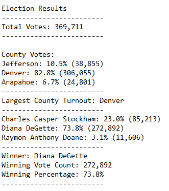
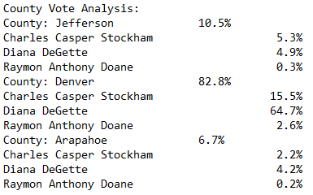

# Election_Analysis
## Project Overview

The purpose of this analysis is to assist the Colorado Board of Elections conduct an audit on the tabulated results of a US Congressional election.  Specifically, the audit includes answers to the questions of how many votes were cast, the total votes cast for each candidate, each candidate’s % of vote total, the total votes cast by county, and which candidate won the election.

## Resources
- Data Source: election_results.csv
- Software : Python 3.8.9, Visual Studio Code, 1.55.2

## Summary of results

[Election Results](other_resources/Election_Results.png?raw=true "Election Results")

- Total number of votes cast: 369,711
- Summary of County voting results:
      Jefferson: 10.5% (38,855 Votes), 
      Denver: 82.8% (306,055 Votes), 
      Arapahoe: 6.7% (24,801 Votes)
- County with the greatest number of votes in the district: Denver (82.8% of Votes cast)
- Candidate Results Breakdown:
          Charles Casper Stockham: 23.0% (85,213 Votes), 
          Diana DeGette: 73.8% (272,892 Votes), 
          Raymon Anthony Doane: 3.1% (11,606 Votes)
- Winner of the election:
          Diana DeGette with 272,892 votes, or 73.8% 

## Audit summary
Given the tabulated data is carried in the same way, this code is portable to any US Congressional election.  For elections in which the data is not carried exactly this way, certain minor modifications will need to be made.  For instance, elections at the county level itself likely have municipalities instead of counties as the base level of vote aggregation.  Municipal elections also will have a different base level.  In terms of broader reach, this script could be used for senatorial and gubernatorial races with little to no modification.

[County Analysis](other_resources/county_analysis.png?raw=true "County Analysis")

Another modification that could be made would be to add a vote breakdown by district, to include the breakdown of votes by candidate by district.  With this, an attribution analysis can be done to understand each district's contribution to the overall result.
